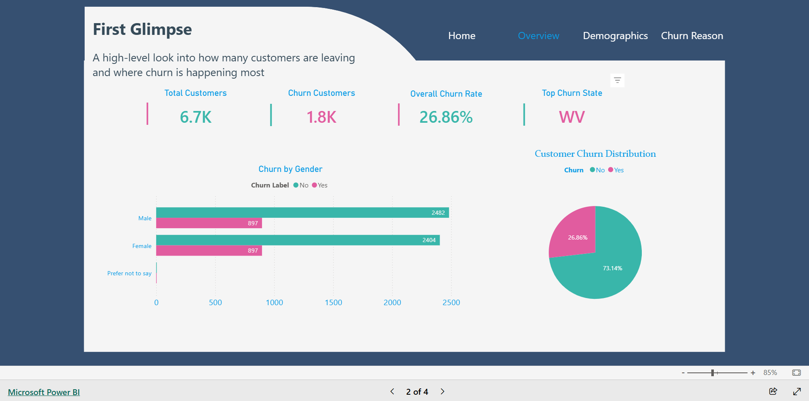
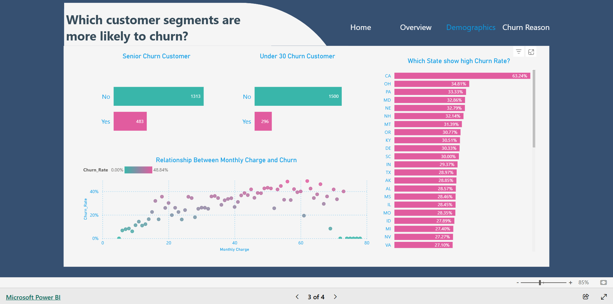
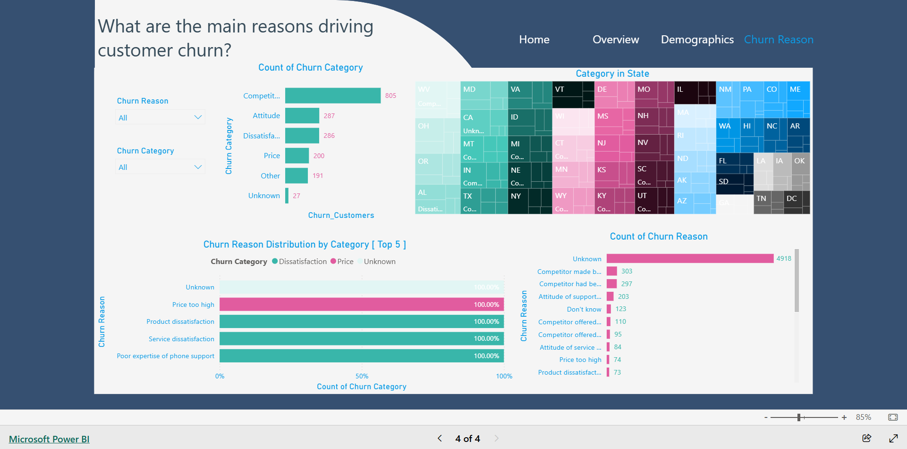

# Customer Churn Analysis Dashboard

This project presents a comprehensive analysis of customer churn, exploring who leaves, where churn is concentrated, and why customers discontinue the service. The analysis combines demographic patterns, service usage behavior, and churn reasons to provide actionable insights for improving customer retention.

## Key Features

- Overview of total customers, churned customers, churn rate, and top churn states.
- Demographic insights highlighting age, gender, and geographic patterns in churn.
- Detailed analysis of churn reasons with interactive filtering by category and region.
- Visual storytelling through bar charts, pie charts, scatter plots, treemaps, and heat maps.

## Key Insights

- Higher monthly charges are linked to increased churn.
- Seniors tend to churn more than younger customers.
- Certain states experience disproportionately high churn.
- Service-related issues are the dominant reasons for churn.
- Churn reasons vary by region, highlighting localized service gaps.

## Recommendations

- Improve service quality in states with high churn.
- Offer tailored retention programs for high-charge customers and seniors.
- Address top churn reasons, focusing on service, pricing, and support.
- Enhance customer service responsiveness and design flexible plans.

## Screenshots

### Home

### Overview

### Demographics

### Churn Reason

